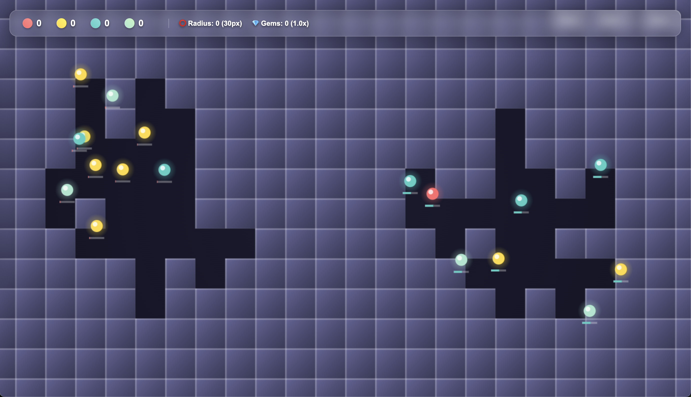

# zen-blaster

A stress-relief game where you place bombs on tiles to explode and collect gems.



## How to Play

- Click on tiles to place bombs
- Watch them explode and release gems
- Collect the gems that appear
- Enjoy the satisfying chain reactions!

## Development

### Getting Started

```bash
# Install dependencies
npm install

# Start development server
npm run dev

# Or just start the server
npm start
```

The game will be available at http://localhost:8000

### Built With

- HTML5 Canvas
- JavaScript
- CSS

## Deployment

This project automatically deploys to GitHub Pages when pushed to the main branch using GitHub Actions.
